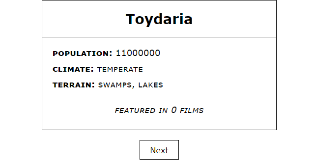

# Exibidor de Planetas dos filmes do Star Wars.
> Desafio para a vaga de Desenvolvedor Frontend na b2w digital.



## Pré-requisitos


- Interpretador Node v8+ junto com o NPM v6+
- Browser atual


## Instalação e execução


**Windows, OS X & Linux:**

Baixe o arquivo zip e o descompacte ou baixe o projeto para sua máquina através do git clone [https://github.com/randercarlos/star-wars-planet-react.git](https://github.com/randercarlos/star-wars-planet-react.git)


- Entre no prompt de comando e vá até a pasta do projeto:

```sh
cd ir-ate-a-pasta-do-projeto
```

- Instale as dependências do node.js através do comando:

```sh
npm install
```

- Com as dependências instaladas, execute o comando:

```sh
npm start
```

- Se tudo der certo, o terminal exibirá uma mensagem que o projeto estará rodando no [http://localhost:3000](http://localhost:3000).

- Abra um navegador atual qualquer e execute o http://localhost:3000 para ver o projeto funcionando...

## Autor

Rander Carlos – randerccf@gmail.com
